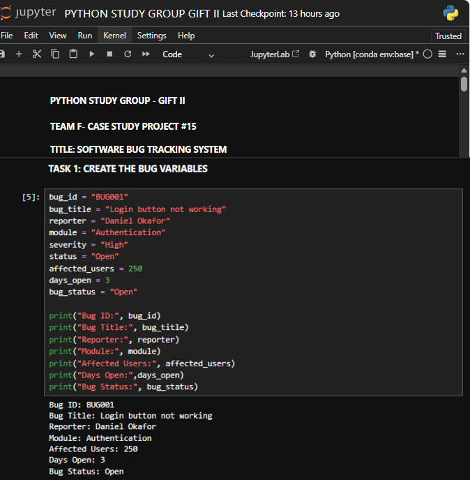

# Python-Study-Group-Gift-II-Team-F

Team F | Case Study Project #14 | Software Bug Tracking System

**Deadline:** 30 August 2026

---

## Project Overview

This project is a Python-based Software Bug Tracking System developed as part of the Python Study Group Gift II Case Study Project.

The system simulates a simple bug tracking solution for a fictional software development company. It is designed to help the development team record, validate, classify, prioritize, and track software bugs reported by users and the testing team.

The system also identifies bugs requiring immediate attention, processes multiple bug reports, and generates a clear bug tracking report.

---

## Industry Scenario

Every software development team encounters bugs during development and testing.

Examples of software bugs include:

* A login button stops working.
* A payment transaction fails.
* A webpage loads incorrectly.
* A user receives an unexpected error.
* An important software feature stops functioning.

Some bugs are critical and require immediate attention, while others are minor and can be addressed later.

This project provides a simple Python-based solution for organizing and managing these bug reports.

---

## Project Objectives

The Software Bug Tracking System is designed to:

* Collect bug information.
* Validate bug information.
* Classify bug severity.
* Determine bug priority.
* Track bug status.
* Identify bugs requiring immediate attention.
* Process multiple bug reports.
* Generate a clear bug tracking report.

---

## Python Concepts Used

This project combines several Python programming concepts learned during the Python Study Group.

### Conditional Statements

`if`, `elif`, and `else` statements are used to make decisions based on bug information and classification rules.

### Loops

`for` and `while` loops are used to repeat processes and handle multiple bug reports.

### Functions

Functions are used to organize the program into reusable sections and make the code easier to maintain.

### Parameters and Arguments

Parameters and arguments are used to pass information into functions for processing.

### Return Values

Functions return processed results that can be used by other parts of the program.

### Input Validation

The system validates information entered by the user to ensure that the required data follows the expected rules.

### Operators and Logical Expressions

Comparison and logical operators are used to evaluate conditions and determine severity, priority, and status.

### Variable Scope

The project demonstrates how variables can be used within appropriate scopes when organizing functions and the overall program.

---

## System Workflow

The Software Bug Tracking System follows these main steps:

1. Collect bug information.
2. Validate the information provided.
3. Classify the bug severity.
4. Determine the bug priority.
5. Track the current bug status.
6. Identify bugs requiring immediate attention.
7. Process multiple bug reports.
8. Generate a final bug tracking report.

---

## Project Files

### Software Bug Tracking System.ipynb

This Jupyter Notebook contains the complete Python implementation of the Software Bug Tracking System.

### Project Screenshots

The following screenshots document the project development, Python code, and program outputs.

#### Project Introduction

#### Code Section 2

#### Output Section 2

#### Code Section 3

#### Output Section 3

---

## What I Learned

Through this project, I practiced combining multiple Python concepts to develop a practical rule-based system.

The project helped me improve my understanding of:

* Conditional logic
* `if`, `elif`, and `else`
* `for` and `while` loops
* Functions
* Parameters and arguments
* Input validation
* Logical and comparison operators
* Return values
* Variable scope
* Processing multiple records
* Building rule-based systems
* Debugging and testing Python programs
* Generating structured program reports

---

## Author

**Chimamaka Victor Daniel**

**Captain, Team F**

**Case Study Project #14**

---

## Acknowledgements

I sincerely appreciate **Coach Timothy** and **SmartBizCrux Technologies** for their support, instructional resources, and practical guidance throughout the Python Study Group.

---

## Conclusion

The Software Bug Tracking System demonstrates how fundamental Python programming concepts can be combined to solve a practical software development problem.

The project provides a simple approach to collecting and processing bug reports while applying validation, classification, prioritization, status tracking, loops, and functions to produce a useful bug tracking report.

Thank you for exploring my Python Study Group Gift II project.

